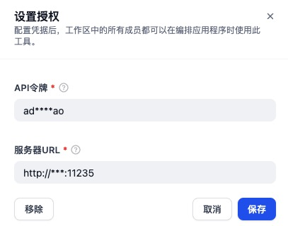
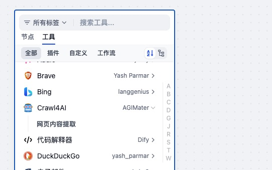

# Crawl4AI Plugin for Dify

## Overview

[Crawl4AI](https://github.com/unclecode/crawl4ai/tree/main) is an open-source web crawler that allows for efficient extraction of content from web pages, This plugin connects Dify to a Docker-deployed Crawl4AI service via HTTP.

## Configuration

### 1. Deploy Crawl4AI Docker Service

First, deploy the Crawl4AI service using Docker on your server. Follow the instructions on the [Crawl4AI documentation](https://docs.crawl4ai.com/).

### 2. Get Crawl4AI Plugin from Plugin Marketplace

The Crawl4AI plugin can be found in the Plugin Marketplace. Install it first.

### 3. Fill in the configuration in Dify

On the Dify navigation page, click `Tools > Crawl4AI > To Authorize` and fill in the following information:

- **Server URL**: Your Crawl4AI service URL, e.g., `http://localhost:11235`
- **API Token**: The authentication token for your Crawl4AI service

### 4. Use the tool

You can use the Crawl4AI tool in the following application types:

#### Chatflow / Workflow applications

Both Chatflow and Workflow applications support adding `Crawl4AI` tool nodes for web content extraction.

#### Agent applications

Add the Crawl4AI tool in the Agent application, then use web extraction commands to call this tool.

## Features

- Web Content Extraction
    - **Web Content Extraction**: Extract content from web pages using Crawl4AI's API
    - **Selector Support**: Target specific content using CSS selectors
    - **Formatted Output**: Support for Markdown and HTML output formats
    - **Tag Exclusion**: Ability to exclude specific HTML tags from extraction
    - Python code reference: unclecode/crawl4ai/docs/examples/docker_example.py

## Development

For development information, please refer to the [Dify Plugin Development Documentation](https://docs.dify.ai/plugins/develop-plugins). 

Source code is available at: https://github.com/AGIMaster/dify-plugin-my-development/tree/master/tools/crawl4ai
