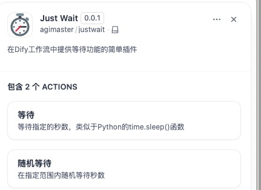

# JustWait Plugin for Dify

## Introduction

This plugin was developed because I've had enough of having to use the CODE plugin specifically to write Python snippets to implement sleep functionality, which is essential in flow loops. The JustWait plugin provides simple waiting capabilities, similar to Python's `time.sleep()`, allowing you to easily implement delays in your Dify workflows.

## Features

JustWait plugin offers two main tools:

1. **Wait** - Wait for a specified number of seconds
   - Parameter: `seconds` - Number of seconds to wait

2. **Random Wait** - Wait for a random period within a specified range
   - Parameters:
     - `min_seconds` - Minimum number of seconds to wait
     - `max_seconds` - Maximum number of seconds to wait

## Usage Examples

### Using the Wait Tool in Workflows
1. Add the JustWait tool to your Dify workflow
2. Select the Wait tool
3. Set the `seconds` parameter to your desired wait time (e.g., 5)
4. Run the workflow, and it will pause for 5 seconds at this step before continuing

### Using the Random Wait Tool in Workflows
1. Add the JustWait tool to your Dify workflow
2. Select the Random Wait tool
3. Set the `min_seconds` parameter (e.g., 3) and `max_seconds` parameter (e.g., 10)
4. Run the workflow, and it will pause for a random period between 3-10 seconds before continuing

## Use Cases

- Adding delays in loop operations to avoid too frequent API requests
- Simulating intervals between user operations
- Controlling execution speed when testing workflows
- Implementing simple polling mechanisms while waiting for external services to respond

## Important Notes

- This plugin does not require any authentication
- It does not collect any user data
- When setting wait times, please consider reasonable ranges, as excessively long waits may cause workflow execution timeouts 
- Python code reference: https://github.com/AGIMaster/dify-plugin-my-development/tree/master/tools/justwait